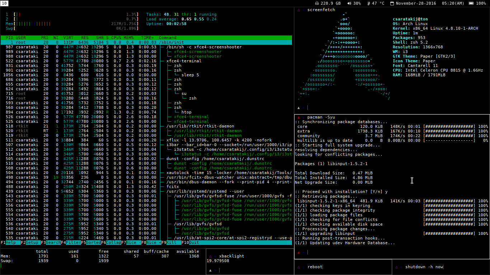

# Note
- Change dir "xlock" to ".xlock" -> move to home dir (~)
- Change "cdmrc" to ".cdmrc" -> (~)
- Change "dunstrc" to ".dunstrc" -> (~)
- Change "tmux.conf" to ".tmux.conf" -> (~)
- Change "Xdefaults" to ".Xdefaults" -> (~)
- Change "xinitrc" to ".xinitrc" -> (~)
- Change "zshrc" to ".zshrc" -> (~)
- Change "vimrc" to ".vimrc" -> (~)
- Change "vimfx" to ".vimfx" -> (~)
- Copy "geometry.zsh-theme" to ("~/.oh-my-zsh/custom/themes/")

# Dependencies
- X11
- [FontAwesome](https://github.com/FortAwesome/Font-Awesome)
- [powerline (fonts)](https://github.com/powerline/fonts)
- scrot
- imagemagick
- xautolock
- xfce4-screenshooter
- lxterminal
- [xflux](https://justgetflux.com/)
- dunst
- [oh-my-zsh](https://github.com/robbyrussell/oh-my-zsh)
- fcitx
- gtk2
- gtk3
- [ag](https://github.com/ggreer/the_silver_searcher)
- xdg-user-dirs
- vimfx(https://github.com/akhodakivskiy/VimFx)

# Desktop themes
- [paper-gtk-theme](https://github.com/snwh/paper-gtk-theme)
- [paper-icon-theme](https://github.com/snwh/paper-icon-theme)
- [paper-cursor-theme](https://github.com/snwh/paper-icon-theme)

# Display Manager
- [cdm](https://github.com/ghost1227/cdm)

# Shell
- zsh

# Zsh theme
- [geometry](https://github.com/frmendes/geometry)

