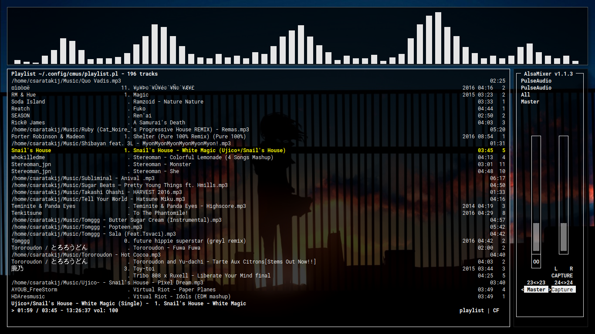
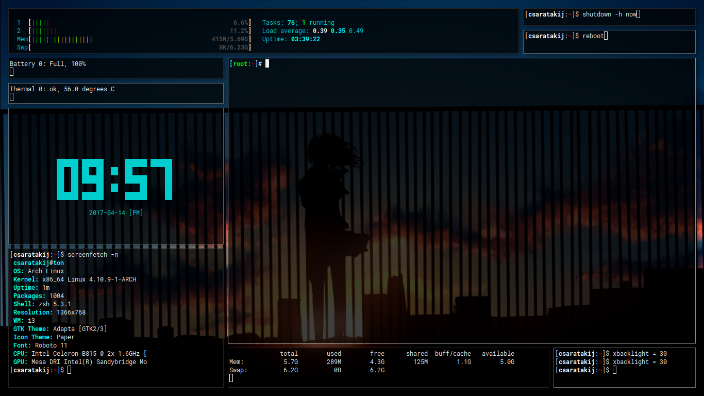

# Renovate Result :

# What's new
- New system dashboard workspace layout.
- New music workspace layout.
- New desktop wallpaper.
- Use "compton" as compositor.
- Use "urxvt" as terminal with transperent background.
- Remove "i3bar".
- Replace "i3" with "i3-gaps".
- Replace "dmenu" with "rofi".
- Add "Mod + Shift + ;" to show rofi's window switcher dialog.
- Add "Mod + :" to show tmux's workspace switcher dialog.
- Add "cava" to music workspace.
- Add "tty-clock" to system dashboard workspace.
- Make "urxvt" as default terminal.

# Workspace Rules
- (1) : Web Browser -> (Chrome, Firefox, etc..)
- (2) : Communication -> (Voip program(Skype, Teamspeaks), Chat(Discord, Weechat), etc..)
- (3) : Games -> (Steam, Itch.io, etc..)
- (4) : General Purpose
- (5) : General Purpose
- (6) : General Purpose
- (7) : Assests Creation Program -> (Gimp, Kritra, Inkscape, Blender, Audacity, etc..)
- (8) : Music & Video stuff + Audio mixer -> (Cmus, Mps-Youtube, alsamixer, etc..)
- (9) : Current Serious Works -> (Game Engine, Working Program Project, etc..)
- (10) : System Dashboard & System Mantinence -> (htop, free, screenfetch, terminal with pacman, etc..)

# Config Directory
- Copy "i3-gaps/*" to "~/.config/i3"
- Copy "cava/*" to "~/.config/cava"
- Copy "cdmrc" to "~/.cdmrc"
- Copy "tmux.conf" to "~/.tmux.conf"
- Copy "Xdefaults" to "~/.Xdefaults"
- Copy "Xresources" to "~/.Xresources"
- Copy "xinitrc" to "~/.xinitrc"
- Copy "zshrc" to "~/.zshrc"
- Copy "vimrc" to "~/.vimrc"
- Copy "vimfx" to "~/.vimfx"
- Move "/usr/share/cmus/default.theme" to "default_ori.theme" && Copy "cmus/default.theme" to "~/.config/cmus"
- Copy "kmscon/kmscon.conf" to "/etc/kmscon"

# Dependencies
- [i3-gaps](https://github.com/Airblader/i3)
- [FontAwesome](https://github.com/FortAwesome/Font-Awesome)
- [powerline (fonts)](https://github.com/powerline/fonts)
- [Noto Sans](https://fonts.google.com/specimen/Noto+Sans)
- [Roboto](https://fonts.google.com/specimen/Roboto)
- [RobotoMono](https://fonts.google.com/specimen/Roboto+Mono)
- [screenfetch](https://github.com/KittyKatt/screenFetch)
- [tty-clock](https://github.com/xorg62/tty-clock)
- [cava](https://github.com/karlstav/cava)
- feh
- scrot
- imagemagick
- ibus
- xfce4-screenshooter
- urxvt
- [xflux](https://justgetflux.com/)
- [oh-my-zsh](https://github.com/robbyrussell/oh-my-zsh)
- gtk3
- [ag](https://github.com/ggreer/the_silver_searcher)
- xdg-user-dirs
- vim
- [vimfx](https://github.com/akhodakivskiy/VimFx)
- [fdir](https://github.com/RealtimeBagIdea/FDir)
- [plymouth](https://www.freedesktop.org/wiki/Software/Plymouth)
- [lnxpcs](https://github.com/jstpcs/lnxpcs)

# Desktop themes
- [adapta-gtk-theme](https://github.com/adapta-project/adapta-gtk-theme)
- [paper-icon-theme](https://github.com/snwh/paper-icon-theme)

# Display Manager
- [cdm](https://github.com/ghost1227/cdm)

# Shell
- zsh

# Zsh theme
- [mh](https://github.com/robbyrussell/oh-my-zsh/blob/master/themes/mh.zsh-theme)

